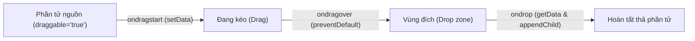
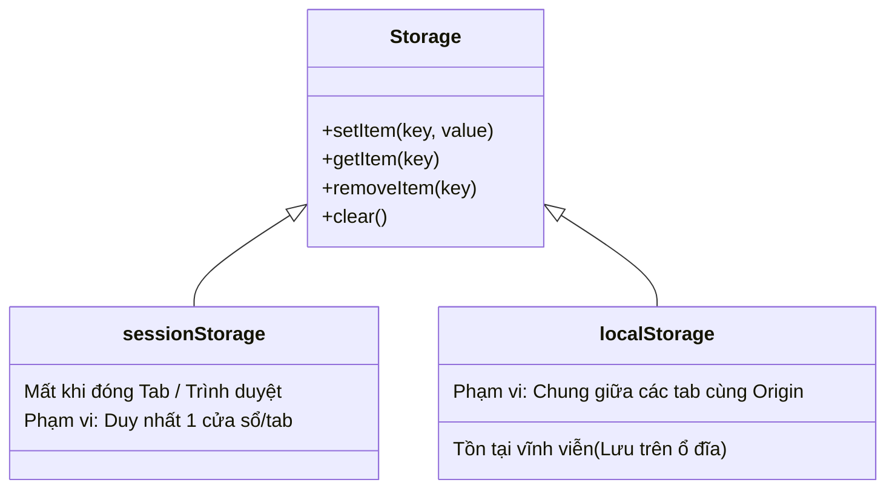
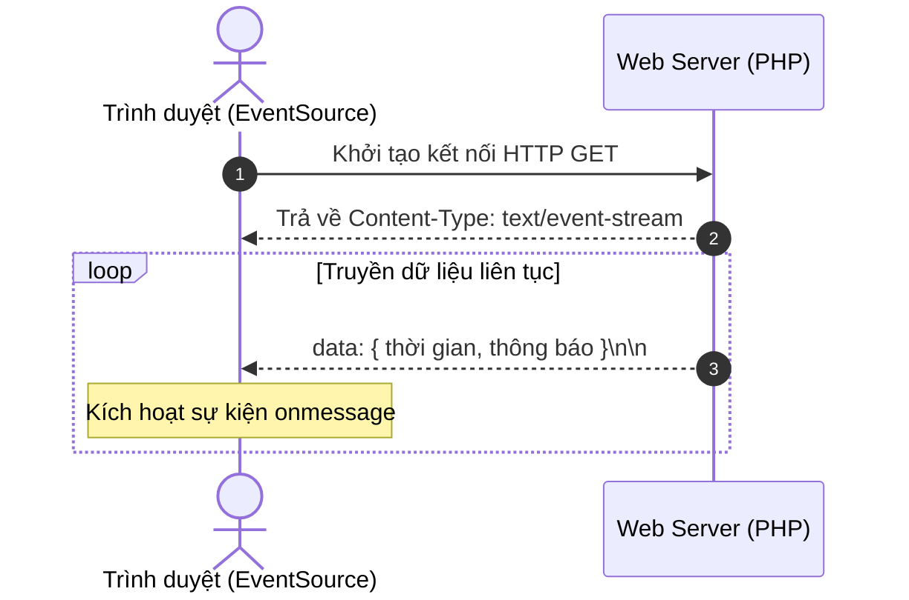
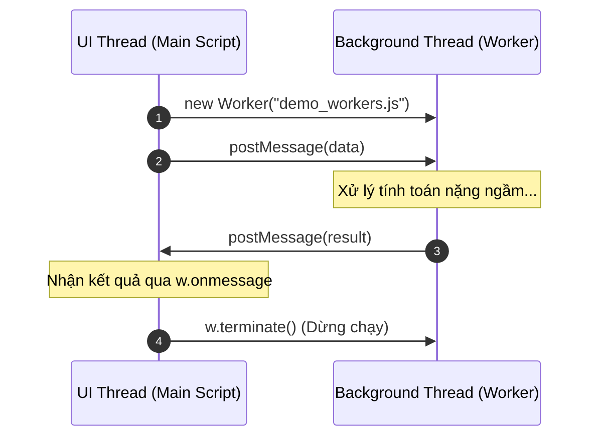

# 🌐 HTML5 Nâng Cao: APIs & Đa Phương Tiện

> [!abstract] Tổng quan bài học
> Ghi chú hệ thống hóa các tính năng chuyên sâu của HTML5 bao gồm:
> - **Đồ họa & Media:** [[Canvas]], [[Audio & Video]], Helper Plugins (`<object>`, `<embed>`), YouTube Embeds.
> - **Web APIs hiện đại:** [[Geolocation API]], [[Drag and Drop API]], [[Web Storage]], [[Server-Sent Events (SSE)]], [[Web Workers]].

---

## 🎨 1. HTML5 Canvas

Vùng vẽ đồ họa 2 chiều trực tiếp trên trình duyệt thông qua [[JavaScript]].

> [!info] Ứng dụng
> Thường dùng để vẽ biểu đồ thống kê, chỉnh sửa/xử lý pixel ảnh, lập trình game 2D và tạo hoạt ảnh (animation).

### Khởi tạo phần tử Canvas
```html
<!DOCTYPE html>
<html>
<head>
  <style>
    #mycanvas { border: 1px solid red; }
  </style>
</head>
<body>
  <canvas id="mycanvas" width="300" height="200"></canvas>
</body>
</html>
```

### Lấy ngữ cảnh vẽ (Rendering Context)
```javascript
const canvas = document.getElementById("mycanvas");

// Luôn kiểm tra tính năng hỗ trợ getContext của trình duyệt
if (canvas.getContext) {
  const ctx = canvas.getContext('2d');
  // Thực hiện các thao tác vẽ tại đây
} else {
  console.warn("Trình duyệt không hỗ trợ Canvas.");
}
```

> [!tip] 16 Kỹ thuật cốt lõi trên Canvas
> | Nhóm tạo hình | Nhóm biến đổi & Hiệu ứng |
> | :--- | :--- |
> | 1. `Drawing Rectangles` (Hình chữ nhật) | 9. `Pattern & Shadow` (Họa tiết & Đổ bóng) |
> | 2. `Drawing Paths` (Đường dẫn) | 10. `Canvas States` (`save()` / `restore()`) |
> | 3. `Drawing Lines` (Đoạn thẳng) | 11. `Translation` (Dời gốc tọa độ) |
> | 4. `Drawing Bezier` (Đường cong Bezier) | 12. `Rotation` (Phép xoay góc) |
> | 5. `Using Images` (Chèn hình ảnh) | 13. `Scaling` (Co giãn tỉ lệ) |
> | 6. `Create Gradients` (Màu chuyển sắc) | 14. `Transform` (Biến đổi ma trận) |
> | 7. `Styles and Colors` (Màu & Nét vẽ) | 15. `Composition` (Trộn lớp hiển thị) |
> | 8. `Text and Fonts` (Định dạng chữ) | 16. `Animation` (Chuyển động liên tục) |

---

## 🎬 2. HTML Media & Plugins

### 2.1. Thẻ `<audio>` & `<video>`
Loại bỏ hoàn toàn sự phụ thuộc vào các bên thứ ba để phát đa phương tiện.

```html
<!-- Trình phát âm thanh -->
<audio controls>
  <source src="audio/horse.ogg" type="audio/ogg">
  <source src="audio/horse.mp3" type="audio/mpeg">
  Trình duyệt không hỗ trợ thẻ audio.
</audio>

<!-- Trình phát video -->
<video width="320" height="240" controls>
  <source src="video/movie.mp4" type="video/mp4">
  <source src="video/movie.ogg" type="video/ogg">
  Trình duyệt không hỗ trợ thẻ video.
</video>
```

### 2.2. Helper Applications: `<object>` và `<embed>`
Được dùng để nhúng các định dạng tài nguyên đặc thù (PDF, Flash, Java Applets, hoặc file HTML con).

> [!note] Phân biệt `<object>` và `<embed>`
> - `<object>`: Chuẩn W3C lâu đời, hỗ trợ fallback nội dung bên trong nếu trình duyệt không tải được tài nguyên.
> - `<embed>`: Được chuẩn hóa từ HTML5, cú pháp ngắn gọn, không có thẻ đóng và không hỗ trợ fallback.

```html
<!-- Nhúng qua <object> -->
<object width="100%" height="400px" data="document.pdf"></object>

<!-- Nhúng qua <embed> -->
<embed width="100%" height="400px" src="document.pdf">
```

### 2.3. Nhúng Video YouTube qua `<iframe>`

```html
<!-- Video cơ bản -->
<iframe width="420" height="315" 
  src="https://www.youtube.com/embed/tgbNymZ7vqY">
</iframe>
```

> [!example] Các tham số URL thường dùng:
> - `?autoplay=1`: Tự động phát khi tải trang.
> - `?controls=0`: Ẩn thanh công cụ điều khiển.
> - `?playlist=VIDEO_ID&loop=1`: Lặp lại vô tận (bắt buộc truyền kèm ID danh sách phát).

---

## 📍 3. HTML5 Geolocation API

API định vị vị trí địa lý của thiết bị.

> [!warning] Nguyên tắc bảo mật
> Trình duyệt **bắt buộc** phải hỏi ý kiến người dùng thông qua hộp thoại cấp quyền. Nếu người dùng chọn **Deny**, API sẽ không thể lấy dữ liệu.

```javascript
const display = document.getElementById("demo");

function getLocation() {
  if (navigator.geolocation) {
    navigator.geolocation.getCurrentPosition(showPosition, showError);
  } else {
    display.innerHTML = "Trình duyệt không hỗ trợ Geolocation API.";
  }
}

function showPosition(position) {
  display.innerHTML = `Vĩ độ: ${position.coords.latitude} <br>Kinh độ: ${position.coords.longitude}`;
}

function showError(error) {
  switch(error.code) {
    case error.PERMISSION_DENIED:
      display.innerHTML = "Người dùng từ chối cấp quyền truy cập vị trí.";
      break;
    case error.POSITION_UNAVAILABLE:
      display.innerHTML = "Không thể xác định thông tin tọa độ.";
      break;
    case error.TIMEOUT:
      display.innerHTML = "Hết thời gian chờ nhận phản hồi vị trí.";
      break;
    case error.UNKNOWN_ERROR:
      display.innerHTML = "Đã xảy ra lỗi không xác định.";
      break;
  }
}
```

---

## 🖲️ 4. HTML5 Drag and Drop API

Quy trình kéo - thả phần tử trực tiếp trên giao diện:



### Mã HTML
```html
<!-- Vùng thả (Drop Target) -->
<div id="dropBox" ondrop="drop(event)" ondragover="allowDrop(event)"></div>

<!-- Phần tử có thể kéo (Draggable Element) -->

```

### Mã JavaScript
```javascript
// 1. Cho phép thả vào vùng này (hủy bỏ hành vi chặn mặc định)
function allowDrop(ev) {
  ev.preventDefault();
}

// 2. Lưu ID của phần tử đang được kéo vào DataTransfer
function drag(ev) {
  ev.dataTransfer.setData("text", ev.target.id);
}

// 3. Lấy phần tử ra và gắn vào vùng đích
function drop(ev) {
  ev.preventDefault();
  const data = ev.dataTransfer.getData("text");
  ev.target.appendChild(document.getElementById(data));
}
```

---

## 💾 5. Web Storage API

Cơ chế lưu trữ cặp `Key-Value` tại Client thay thế cho cookie truyền thống.

### So sánh Cookie và Web Storage
| Tiêu chí | [[HTTP Cookie]] | HTML5 Web Storage |
| :--- | :--- | :--- |
| **Dung lượng** | Giới hạn $\approx 4\text{ KB}$ | Dung lượng lớn ($\approx 5 - 10\text{ MB}$) |
| **Băng thông mạng** | Tự động gửi kèm mọi HTTP request | Không gửi qua mạng, chỉ nằm tại client |
| **Bảo mật mạng** | Dễ bị sniff nếu không có SSL/HTTPS | Nằm cục bộ trong trình duyệt |

### Phân loại Web Storage



### Thao tác với Web Storage
```javascript
// Lưu và đọc Session Storage
if (sessionStorage.hits) {
  sessionStorage.hits = Number(sessionStorage.hits) + 1;
} else {
  sessionStorage.hits = 1;
}

// Lưu và đọc Local Storage
if (localStorage.hits) {
  localStorage.hits = Number(localStorage.hits) + 1;
} else {
  localStorage.hits = 1;
}

// Xóa dữ liệu
localStorage.removeItem('hits'); // Xóa theo khóa cụ thể
localStorage.clear();            // Xóa sạch toàn bộ storage
```

> [!danger] Lưu ý bảo mật
> Tuyệt đối không lưu các thông tin nhạy cảm (như mật khẩu, token quyền hạn cao không mã hóa) vào `localStorage` vì dễ bị tấn công qua lỗ hổng **XSS (Cross-Site Scripting)**.

---

## 📡 6. Server-Sent Events (SSE)

Cơ chế cho phép máy chủ chủ động đẩy dữ liệu theo một chiều (**Server $\rightarrow$ Client**) thông qua kết nối HTTP liên tục.



### Client: Sử dụng `EventSource`
```javascript
if (typeof(EventSource) !== "undefined") {
  const source = new EventSource("demo_sse.php");

  source.onopen = (e) => console.log("Đã kết nối máy chủ");
  
  source.onmessage = function(event) {
    document.getElementById("result").innerHTML += event.data + "<br>";
  };

  source.onerror = (err) => console.error("Lỗi SSE:", err);
} else {
  console.warn("Trình duyệt không hỗ trợ SSE.");
}
```

### Server (PHP Example)
```php
<?php
// Bắt buộc cấu hình đúng header của SSE
header('Content-Type: text/event-stream');
header('Cache-Control: no-cache');

$time = date('r');

// Định dạng chuẩn: bắt đầu bằng "data: " và kết thúc bằng hai dấu xuống dòng "\n\n"
echo "data: Giờ hiện tại: {$time}\n\n";
flush();
?>
```

---

## ⚙️ 7. Web Workers

Cung cấp khả năng xử lý đa luồng (multi-threading) trong [[JavaScript]], đưa các phép tính nặng ra chạy ngầm ở luồng riêng biệt để tránh làm treo/đơ giao diện người dùng (UI Thread).



> [!warning] Giới hạn của Web Workers
> Web Worker **không thể truy cập trực tiếp vào [[DOM]]** (không dùng được `document`, `window`, `parent`). Tất cả giao tiếp phải thông qua phương thức `postMessage()` và lắng nghe sự kiện `onmessage`.

### Bước 1: Tạo file tính toán nền (`demo_workers.js`)
```javascript
let i = 0;

function timedCount() {
  i = i + 1;
  postMessage(i); // Gửi kết quả về main script
  setTimeout(timedCount, 500);
}

timedCount();
```

### Bước 2: Điều khiển Worker từ Main Script
```javascript
let w;

function startWorker() {
  if (typeof(Worker) !== "undefined") {
    if (typeof(w) === "undefined") {
      w = new Worker("demo_workers.js");
    }
    // Lắng nghe dữ liệu trả về từ worker
    w.onmessage = function(event) {
      document.getElementById("result").innerHTML = event.data;
    };
  } else {
    alert("Trình duyệt không hỗ trợ Web Workers!");
  }
}

function stopWorker() {
  if (typeof(w) !== "undefined") {
    w.terminate(); // Chấm dứt tiến trình chạy ngầm
    w = undefined; // Giải phóng bộ nhớ
  }
}
```

---

## 📑 8. Bảng Tổng Hợp Tham Chiếu Nhanh

| Tính năng | API / Đối tượng chính | Vai trò chính | Ngữ cảnh sử dụng |
| :--- | :--- | :--- | :--- |
| **Canvas** | `<canvas>`, `getContext('2d')` | Vẽ đồ họa 2D | Game, đồ thị, chỉnh ảnh client |
| **Media** | `<audio>`, `<video>` | Phát âm thanh & video gốc | Trình chiếu đa phương tiện |
| **Geolocation** | `navigator.geolocation` | Lấy kinh độ / vĩ độ | Bản đồ, gợi ý địa điểm gần nhất |
| **Drag & Drop** | `dataTransfer`, `draggable` | Kéo thả trực quan | Bảng Kanban, sắp xếp giỏ hàng |
| **Web Storage** | `localStorage`, `sessionStorage` | Lưu trữ dữ liệu cấu trúc | Lưu cache, giỏ hàng, thông tin form |
| **SSE** | `EventSource` | Nhận luồng dữ liệu 1 chiều | Giá cổ phiếu, feed tin tức, tỷ số |
| **Web Workers**| `new Worker()`, `postMessage` | Chạy nền đa luồng | Mã hóa dữ liệu, xử lý ảnh dung lượng lớn |

---
## 🔗 Liên kết mở rộng
- [[HTML5 Semantic Elements]]
- [[JavaScript Asynchronous]]
- [[WebSockets vs SSE]]
- [[Client-side Security & XSS]]